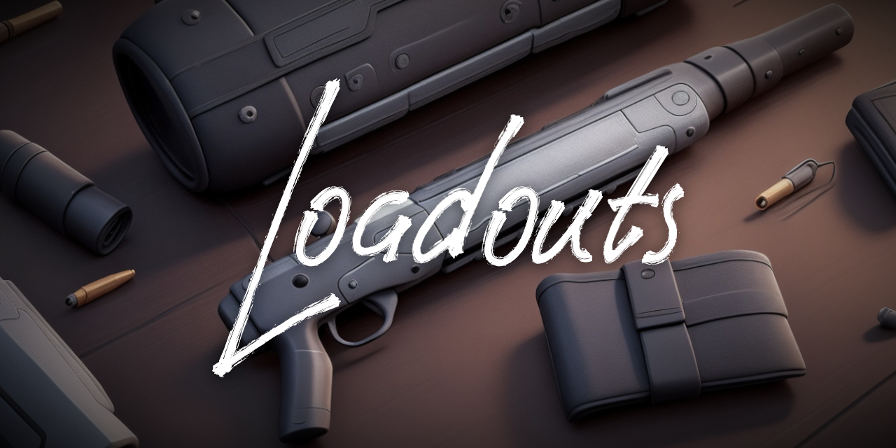
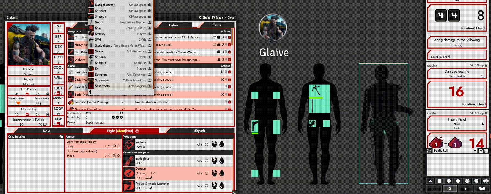

# foundry-vtt-loadouts

## A Visual Inventory system for Foundry VTT
Loadouts allows the GM to create visual Loadouts of any variety and style that are updated by and interact with the character's normal inventory actions.

The goal of Loadouts is to allow GMs and players to better visualize their character's weaponry, dress, and other visual elements that normally go unchecked in VTT games but which may provide a great deal of additional character and narrative development opportunities. Also it's fun.

Current work is atop the Cyberpunk Red Core system, but as of alpha 2.3+ we are system-agnostic and in the future, system-specific resources including extended functionality and preconfigured items will be made available.

## How it works
When items that have been configured for Loadouts are added to a player's inventory, a token-based representation of that item is added to a dedicated Loadouts Foundry scene. This scene contains Loadouts tiles that can be assigned different properties, including player ownership and type of allowed item, and which represent the player's inventory 'slots.'

A basic algo identifies free spaces within a series of tiles that are assigned to the player and attempts to place a token representing the item into a preferred 'slot'. As the player's slots fill up, items will be placed in ever-less-desirable locations, with the result that eventually a player must run out of physical carrying space.

## Basic usage
_As this is in an alpha stage and many customization elements are still in development, these directions may change quickly. Breaking changes may also be introduced that will require the reconfiguration of scenes and tiles._

1. Create a scene to use for your Loadouts (in the future the module will include a test scene)
2. Use the included macro `setLoadoutsScene` to flag the current scene as a Loadouts scene.
3. Populate the scene with rectangular tiles that represent grid-based inventories.
4. Select one or more tiles and use the included macro `setLoadoutsTiles` to configure them as Loadouts tiles. This will allow you to determine which player owns the inventory as well as what sorts of items should be stored there.
5. Configure Loadouts items using the `setLoadoutsItems` macro. This will let you set or modify the size, image path, and stack quantity of the item's representative token. Additional modules with preconfigured items and scenes will be made available for various systems.
6. Consult the configuration options in the main Foundry `Configure Settings` window.

# Configuration Options
## System-Wide
`Managed Item Types` Lets you specify which types of items (as defined by the Foundry system being used) are available for management by Loadouts. _This list will only include types of item that are represented in your local game - that is, items you have imported from system compendiums or created yourself and which show up under the GM's Items toolbar._

`Managed Actor Types` Foundry systems have different actor types for things like player characters, NPCs, vehicles, etc. Here you can choose which types of actors are allowed to have inventories that may interact with Loadouts. _This list will only include types of actor that you have created an instance of. That is, an `npc` option will not be displayed unless you have created an NPC actor prior._

`Allow Unconfigured Items` Some items that are part of a Loadouts-managed item type may not qualify as items that you wish Loadouts to represent visually. For instance, Cyberpunk Red players may have the 'Martial Arts' skill which is represented as a weapon item to allow attack rolls, but which would not take up carry space in a Loadout. By leaving the item unconfigured and setting this option to True, players can still add the item to their sheet. 

On the other hand you may prefer that EVERYTHING be visually represented, in which case you would uncheck this box to strictly enforce Loadouts management. In such a case, were a player to attempt to add an unconfigured item, the player will get a UI notification that the item is not configured for Loadouts and cannot be added to their inventory. If the item was necessary, the GM would either need to add it for them or configure the item for Loadouts.

`Enable Remote Stashing` Loadouts supports the idea of 'carried' vs 'owned' inventories. Like a chest in a fantasy game, you may choose for the players to have inventories that are not carried on their person but must be accessed from a certain location like a camp or safehouse. Enabling this option allows players the option to 'teleport' new items to remote locations if they do not have room to carry the items on their person.

`Enable Add When Full` If a player has no inventory slots available on their person, and Remote Stashing is not enabled or stashes are also full, the player will have the choice to add the item to their inventory without the accompanying Loadouts configuration and token. If disabled, the player will simply get a message that their inventory is full and the item may not be added.

`Show Token Nameplates` Works just like in normal Foundry - show the item's name (and count if stacked) under the token.

`Show Stack Bar` Uses the token's 'health' bar to display the number of items in stack.

`Stack Overlay Icon` Allows you to set an image path for an overlay that is shown over the tokens of an item stack. Set to empty to disable.

## Item Options
`Image Path` Determines which image is used to represent the item in a Loadouts inventory.

`Token Width` Set the width of the item's token. This and the following option should be set as **grid units**, not pixels.

`Token Height` Set the height of the item's token.

`Stack Size` If more than one of the item should be able to fit in a slot, define how many can be stacked in that one inventory slot. E.g. a quiver that can fit 10 arrows. This number must be at least 1.
_(Note that the core Loadouts module does not support item quantities at this time. That is, if a single item already represents multiple items in the standard inventory (very common with consumables), it still counts as a single item in Loadouts. So if a bundle of arrows held 5x arrows and you wanted an entire quiver to hold 20 arrows, the stack size for the quiver would be 4 to support 4 bundles of 5 arrows. Loadouts add-on modules may implement system-specific support for item quantity at their discretion.)_

`Loadouts Tag` A single alphanumeric tag of 25 characters or less which can be used by Loadouts tiles to filter incoming items. For example, maybe bullets and grenades are both of the type *ammunition* in the game system, but you want grenades to always go to a bandolier slot. By setting a Loadouts tag of 'grenade' we can use the tile configuration options to ensure that our bandolier accepts only grenades and our ammo pouches only ammunition.

## Tile Options

`Character Name` Set the ownership of this tile to a specific player character. (Shared stashes will be implemented later)

`Weight` An arbitrary value between 0-99 that establishes a preference order for the tiles when a new token is being dropped by Loadouts. Preference is in descending order: i.e. you might choose to set a character's 'holster' slot to 0 so that, if a newly-acquired weapon fits in a holster, it is more likely to be placed there than in, say, their backpack.

Currently in Cyberpunk Red with the sample Loadouts scene, I use the following settings:
 - `0` (most-preferred) for their hidden, small holsters at the ankle and under the arm
 - `1` for their hip holsters
 - `2` for their back pockets
 - `3` for their back/shoulder
 - `4` for any carried luggage
 - `5` (least-preferred) for their remote stash or other uncarried inventories

`Storage Name` Allows you to designate names for tiles that may be used for in-game Loadouts notifications. E.g. 'Ni-Con added an Assault Rifle to his back/shoulder.'

`Item Types` (optional) A comma-separated list of system-defined types that may be added to the tile's storage slots. This allows for basic 'dedicated' storage like a tile that only accepts types *food,ingredient* and so won't have a weapon or armor placed in it.

`Item Tags` (optional) A comma-separated list of Loadouts tags that may be added to the tile. For example, maybe a druid's herb pouch would only accept items configured with the Loadouts tag *herb* rather than everything in the system type *ingredient*. If `Item Types` is also set, this is a secondary filter - i.e. both Type and Tag must match for the item to be eligible.

`Equipped State` designates whether the tile is carried or simply owned; that is, whether the inventory items in the tile are considered actively carried by the player or part of a stash left at another location.

Like it? Love it?
https://www.buymeacoffee.com/draphtx